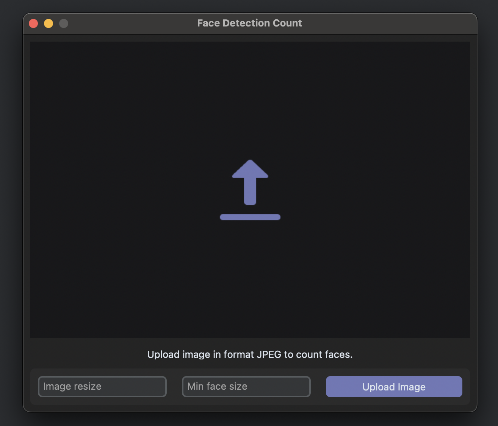
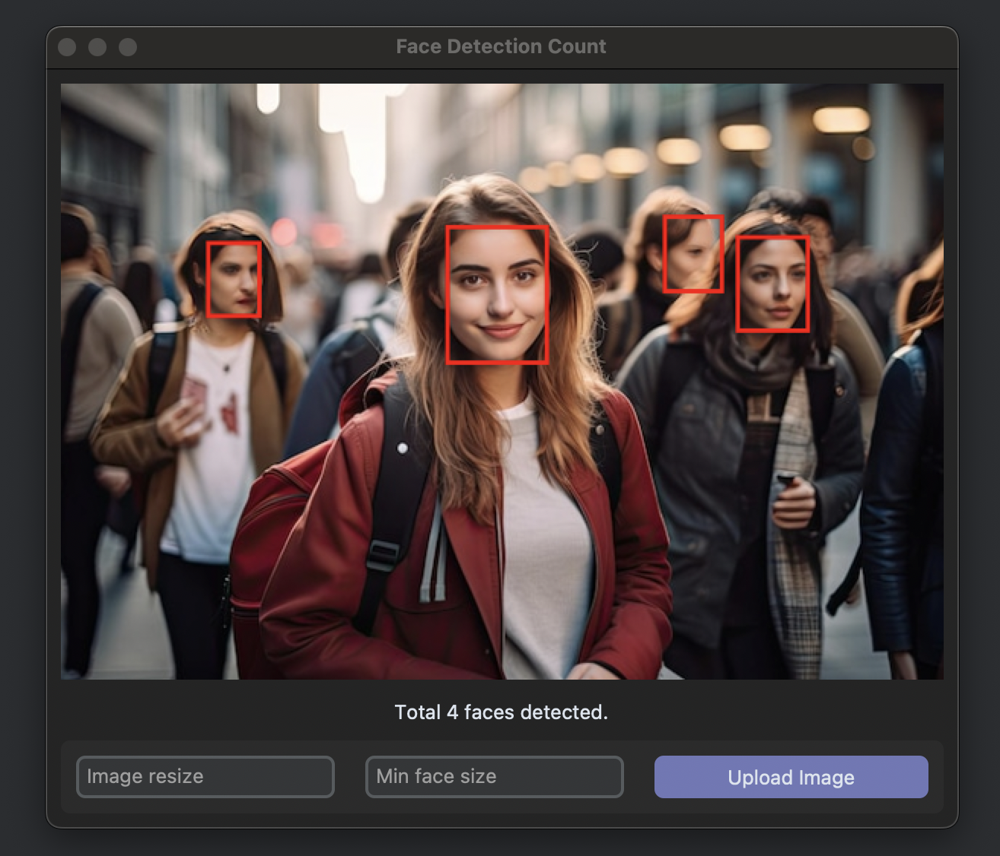

# Python Face Detect (Torch)

> Project for class of machine learn and artificial neural network

## Concepts

- RNA
- CNN
- PyTorch

## Getting Start

Requirements

- Mac `brew install python-tk@3.<version>`
- Linux `sudo apt install python3-tk`

Running Project

- CLI `python basic.py`
- Interface `python main.py`

## Example

Upload Screen

Result Screen

### Created by
© [Giovane Santos](https://giovanesantossilva.github.io), © [Iara Leodoro](https://github.com/yara-leodoro)